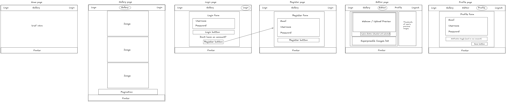

# 📸 Camagru

Camagru is a small web application that allows users to capture or upload photos, apply overlays, and share them publicly in a gallery where others can like and comment.  
It is inspired by Instagram’s core features and built to demonstrate full-stack web application design using **HTML, CSS, JavaScript, and PHP**.

---

## 🧭 1. Project Overview

**Goal:**  
Build a secure, responsive web application that allows users to:
- Capture a photo via webcam or upload one.
- Add superposable overlays (frames, stickers, etc.).
- Save, display, like, and comment on images.
- Manage their user account securely.

---

## 🧩 2. Planning & Design (Before Writing Code)

This section follows the methodology from **Chapter 18: Process & Design** of *Jon Duckett’s HTML & CSS*.

### 👥 Who is the site for?
The site targets:
- **Students and developers** learning full-stack web development.
- **Casual users** who want to create fun photo edits.
- **Recruiters or instructors** evaluating the developer’s ability to plan, design, and secure a small web app.

### 🎯 Why people visit your website
- To **create** and share custom photo edits.
- To **explore** other users’ creations.
- To **interact** via likes and comments.
- To **practice** or **showcase** my technical skills.

### 🧠 What visitors are trying to achieve
- Sign up, log in, and manage their profile.
- Capture or upload an image.
- Apply an overlay and save the edited picture.
- Browse others’ photos and leave comments.
- Like or unlike posts.
- Delete their own creations.

### 📚 What information visitors need
- Clear instructions on how to take/upload photos.
- Feedback messages (e.g., “login failed”, “photo saved successfully”).
- Privacy and data handling information.
- Account settings and email confirmation.
- Accessible navigation (home, gallery, edit page, profile, logout).

### 🔁 How often people will visit your site
- **Active users:** Occasionally (a few times a week) to post or comment.
- **Visitors:** Frequently to explore the gallery.
- The gallery should update dynamically to keep users engaged.

### 🗺️ Site Map
```
Home
 ├── Sign up
 ├── Login
 ├── Gallery
 │    ├── Single Image (likes + comments)
 ├── Editor (requires login)
 │    ├── Webcam capture
 │    ├── Upload image
 ├── Profile
 │    ├── Update username/email/password
 │    ├── Preferences (email notifications)
 ├── About / Help
 └── Logout
```

### 🧱 Wireframes
- **Home Page:** brief intro + login/signup buttons.
- **Gallery:** grid of photos with pagination (5 per page).
- **Editor Page:** webcam preview + overlay selector + capture button + saved images.
- **Profile Page:** form for editing info, password, and notification settings.



### 🎨 Design Principles
- **Responsive layout:** adapts to desktop, tablet, and mobile.
- **Simple colors:** light background, clear contrast for text.
- **Consistent components:** header, footer, and main container across all pages.
- **Focus on usability:** buttons clearly labeled, form validations visible.

---

## ⚙️ 3. Technical Structure

### 💻 Stack
| Layer | Technology | Notes |
|-------|-------------|-------|
| Client | HTML, CSS, JavaScript | Only browser-native APIs allowed |
| Server | PHP (no external libraries beyond standard) | MVC-like structure recommended |
| Database | MySQL | Stores users, images, likes, and comments |
| Container | Docker / Docker Compose | For easy deployment |

### 📦 Folders
```
camagru/
│
├── public/           # Publicly accessible files
│   ├── index.php
│   ├── css/
│   ├── js/
│   ├── images/
│   └── uploads/
│
├── src/              # Application source code (PHP)
│   ├── controllers/
│   ├── models/
│   ├── views/
│   └── utils/
│
├── config/           # Configuration files (.env, db.php)
├── docker/           # Docker configuration
├── tests/            # Test scripts
└── README.md
```

---

## 🧰 4. Getting Started

### 🔹 Prerequisites
Make sure you have:
- Docker & Docker Compose installed  
- A modern browser (Firefox ≥ 41 or Chrome ≥ 46)  

### 🔹 Installation
```bash
# Clone repository
git clone https://github.com/mehdiakacem/camagru.git
cd camagru

# Build and start containers
docker-compose up --build

# Access the app
http://localhost:8080
```

### 🔹 Environment variables
Create a `.env` file in the root directory:
```
DB_HOST=localhost
DB_USER=root
DB_PASS=password
DB_NAME=camagru
MAIL_HOST=smtp.example.com
MAIL_USER=example@example.com
MAIL_PASS=secret
```
*(Ensure `.env` is added to `.gitignore`)*

---

## 🔐 5. Security Requirements
Mandatory (from subject):
- Encrypted passwords (e.g., `password_hash()` / `bcrypt`).
- Input validation and escaping (prevent XSS, CSRF, SQLi).
- Only authenticated users can access editing.
- Email confirmation for registration.
- `.env` file ignored by Git for credentials.

---

## 🌐 6. Features Summary

### ✅ Common
- Responsive layout (header, main, footer).
- Works on Firefox ≥ 41 and Chrome ≥ 46.

### 👤 User
- Sign up / Confirm email / Login / Logout.
- Password reset via email.
- Edit profile info (username, email, password).
- Manage notification preferences.

### 🖼️ Gallery
- Public page listing all edited photos.
- Likes and comments (only for logged-in users).
- Email notification when a photo receives a comment.
- Pagination (≥5 items per page).

### 🎥 Editor
- Webcam preview and image overlay.
- Capture photo or upload file.
- Combine overlay + user photo (server-side).
- Delete only your own images.

---

## 🧱 7. Project Architecture

```
Client (HTML, CSS, JS)
    ↓
PHP Controller (MVC)
    ↓
Database (MySQL)
```
A simple MVC-like structure ensures maintainability and separation of concerns.

---

## 🖼️ 9. Preview

| Page | Screenshot |
|------|-------------|
| Home |  |
| Editor |  |
| Gallery |  |
| Profile |  |

*(Add screenshots once pages are functional.)*

---

## 🤝 10. Contributing

Contributions are welcome!  
If you’d like to propose changes, please:
1. Fork the repository  
2. Create a new branch (`feature/my-feature`)  
3. Commit your changes and push the branch  
4. Open a Pull Request  

---

## 🔮 11. Future Improvements

- Dark mode and theme switcher  
- Infinite scrolling in gallery  
- Live preview of overlays (client-side)  
- Sharing to social networks  
- Render animated GIFs  
- Unit tests for controllers  

---

## 🧾 12. Author & License

Created by **Mehdi Akacem** — part of the **42 Network Camagru project**.  
Free to use and modify under the **MIT License**.
